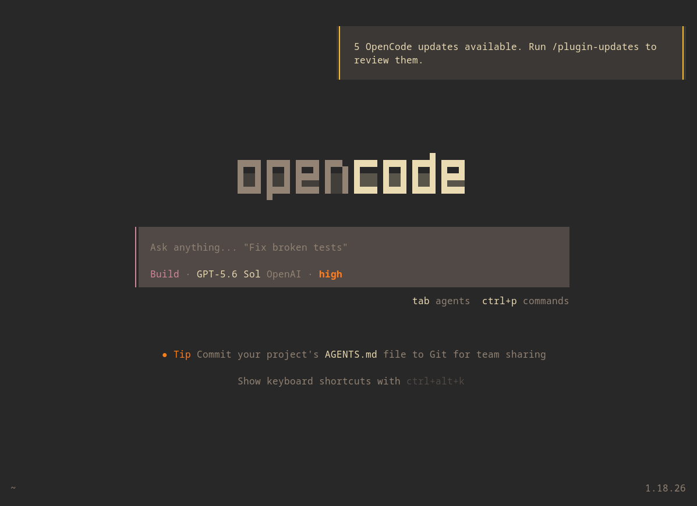
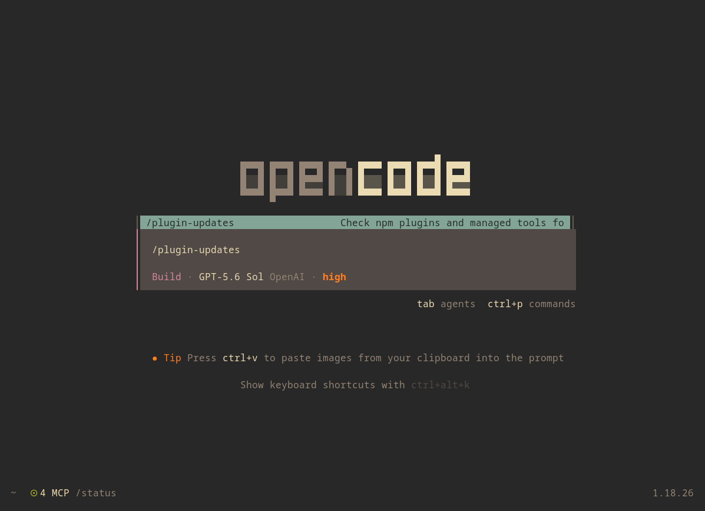

# plugin-updater

An OpenCode plugin that tells you when your plugins and built-in tools have updates waiting, and applies them on the next restart.

## The problem

OpenCode installs npm plugins and managed tools (prettier, pyright, bash-language-server, …) into `~/.cache/opencode/packages`, but nothing ever updates them. Whatever version was current when a package was first cached stays there forever. There's no update check, no notification, and no command to update them. The only remedy is manually deleting cache directories.

## What it does

Once a day (on startup, 24h between checks), it compares the installed version of every plugin and managed tool against `latest` on the npm registry:

- If it finds updates, you get a toast: `N OpenCode updates available. Run /plugin-updates to review them.`
- `/plugin-updates` (command palette or slash command) opens a screen with three groups (Plugins, Managed tools, Skipped) showing `installed → latest` per package.
- Select what you want (Space / `A`), press `U`, confirm, and OpenCode installs the fresh versions itself on the next restart.

The plugin never installs or deletes anything directly. Confirming marks the stale cache entries for removal; when OpenCode exits, they're cleaned up and the built-in resolver installs fresh versions on the next start. Until you restart, nothing on disk changes.

Failures are contained: one unreachable package shows as `unknown` and doesn't break the cycle; a total registry outage keeps the last result on screen.

## What gets checked

- Floating plugin specs from your effective config, like `foo` and `foo@latest`.
- Managed tools: the bundled tools OpenCode installs for you (prettier, pyright, …).

Skipped, with the reason shown on screen: pinned specs (`foo@1.2.3`), local paths, `file:`/`git+`/URL specs, and semver ranges. Those change only when you change them, so updating them automatically makes no sense.

## Install

TUI plugins aren't picked up by the npm plugin scanner, so two steps are needed (both, in this order):

1. Symlink the plugin into the plugins dir:

   ```bash
   ln -sfn <repo>/plugins/plugin-updater/src/update-checker.tsx \
     ~/.config/opencode/plugins/update-checker.tsx
   ```

2. Add the path to the `plugin` array in `~/.config/opencode/tui.json`:

   ```jsonc
   {
     "plugin": ["/home/<user>/.config/opencode/plugins/update-checker.tsx"]
   }
   ```

No build step: the host transpiles the `.tsx` on the fly. Restart OpenCode to pick up edits.

## The /plugin-updates screen

<div style={{ display: flex; justify-content: center; flex-wrap: nowrap; }}>
  
  
</div>

| Key | Action |
| --- | --- |
| `j` / `k` or arrows | Move the cursor |
| Space | Toggle the package under the cursor |
| `A` | Select every selectable package |
| `U` | Prepare updates for the selection (confirm dialog first) |
| `R` | Re-check now (ignores the 24h timer, no toast) |
| Esc | Close |

Pinned, unknown, and skipped rows are shown for information but can never be selected. Confirming shows a pending-restart banner: the marked cache entries are removed when OpenCode exits, and the next start installs the new versions.

## Development

```bash
npm run typecheck   # tsc --noEmit
npm test            # node --test, network-free: registry and cache are fixtures
```
